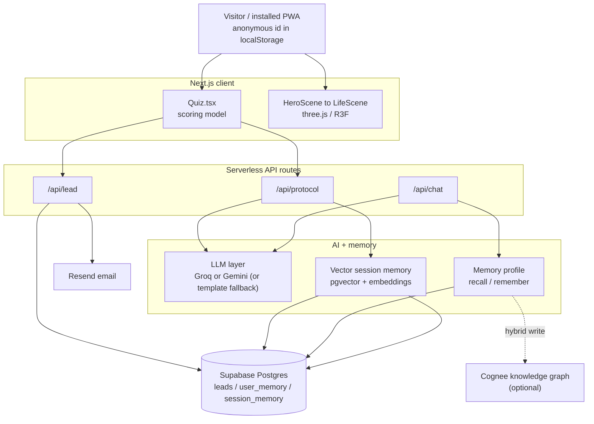

# Alight

**Stop procrastinating by regulating your nervous system.**

Alight reframes procrastination as a *freeze response* from a dysregulated nervous
system, not a willpower problem. It uses 2-minute, state-matched somatic resets to
help you leave survival mode and take one small first action.

- **Landing + quiz funnel:** an 18-statement nervous-system check-in that returns your
  type (Wired / Shutdown / Overloaded / Steady), a Regulation Score, and a free first reset.
- **Daily loop:** Regulate, then Initiate, then Win.
- **AI friends:** two supportive companions (Lily, warm; John, practical) who chat with
  you, remember you across sessions, and offer a tiny next step when it helps.
- Built to ship on free tiers and installable as a PWA on iPhone and Android.

> Alight is a wellbeing tool, not a medical device. It does not diagnose, treat, or cure
> any condition and is not a substitute for professional care.

---

## The approach

Under chronic stress the body reads an ordinary task the way it reads a threat. It does
not fight or flee, it *freezes*. That is the pit in your stomach when you open the laptop,
the fog, the scroll. It is physiology, not character, and physiology is something you can
change. So Alight regulates your state first, then moves you, the two things
procrastination actually needs, in the right order.

---

## Tech stack

| Layer | Choice |
| --- | --- |
| Framework | **Next.js 15** (App Router, React 19, TypeScript), Server + Client Components |
| 3D hero | **three.js** + **@react-three/fiber** (v9) + **@react-three/drei** (v10), lazy-loaded |
| Styling | Hand-written CSS design system (no framework), CSS keyframes, `prefers-reduced-motion` |
| Fonts | Playfair Display + Plus Jakarta Sans via `next/font` |
| Backend | Next.js serverless API routes on **Vercel** (Node runtime) |
| AI / LLM | Swappable free layer: **Groq** (Llama 3.3 70B) or **Google Gemini** (2.5 Flash) |
| RAG / memory | **Supabase Postgres + pgvector**, Gemini embeddings (768-dim); optional **Cognee** graph |
| Data | Supabase (leads, user memory, session memory) |
| Email | **Resend** (transactional quiz-result email) |
| Analytics | Vercel Web Analytics |
| Assets | **Python + Pillow** icon/texture generator (`scripts/generate_assets.py`) |
| Hosting | Vercel free tier, installable PWA (manifest + service worker) |

---

## Architecture

Everything is designed to run on free tiers and to **degrade gracefully**: if no AI key
is set, the friends use on-brand template replies; if Supabase is absent, leads are just
logged; if embeddings are unavailable, semantic recall falls back to recency. The app
never hard-breaks.



**Request flow**

1. **Quiz (client).** `Quiz.tsx` scores 18 statements into two axes (wired / shutdown),
   derives a type and Regulation Score, and requests a personalized reset from
   `/api/protocol`. The email step posts to `/api/lead`.
2. **Protocol (`/api/protocol`).** Runs a small RAG step first (`recallSessions`) to pull
   the most relevant past sessions for that nervous-system type, then asks the LLM to
   generate a state-matched protocol, falling back to a curated static protocol if no
   model is configured.
3. **Chat (`/api/chat`).** Builds the friend persona, folds in what we remember about the
   person (`getMemory().recall`), calls the LLM, and returns a reply (or a template
   fallback). Heavy work (audit log, memory write, vector store) runs in Next.js
   `after()` **after** the reply is sent, so the person never waits.

**Memory + RAG**

- **Session memory (RAG):** short notes per session are embedded with Gemini
  `gemini-embedding-001` (768-dim) and stored in a Supabase `pgvector` column. Recall uses
  a `match_session_memory` Postgres function for cosine similarity; without a key it
  degrades to recency.
- **Person memory:** a small private profile per anonymous user (`summary`, `facts`,
  `recent`), distilled by the LLM so a friend can remember you across chats.
- **Provider-agnostic `MemoryStore`:** the whole memory layer is two verbs, `recall` and
  `remember`. The default engine is Supabase; setting `MEMORY_PROVIDER=cognee` swaps in a
  **Cognee** knowledge graph behind the same interface. A hybrid mode keeps instant
  Supabase reads for live chat while every write also flows into the graph.

**Governance.** Every AI interaction is written to an audit log (`action-log.ts`) with
timestamp, provider, model, latency, input, and output.

---

## Recent redesign

The landing and funnel were rebuilt around a vibrant, elegant identity:

- **Palette:** vivid "sunset aurora" (pink, purple, gold, coral) on a warm blush ground.
- **Typography:** Playfair Display headings with a Plus Jakarta Sans body.
- **Motion:** a real **3D hero** built with three.js / React Three Fiber, a slow revolving
  wheel of *life moments* (work, party, travel, friends, sunrise, dance, nights out), the
  opposite of the freeze the app treats. All motion respects `prefers-reduced-motion`.
- **Logo:** a clear butterfly on a sunset gradient (a butterfly *alights*, and so do you).
- **Copy:** rewritten to sound human, with a no-dash guard added to the AI friend prompt.
- **Icons:** all PWA icons plus a grain texture are generated from one Python script.

---

## Develop

```bash
npm install
npm run dev      # http://localhost:3000
```

## Build

```bash
npm run build
npm start
```

## Brand assets (Python)

The app icons and the UI grain texture are generated procedurally, so the raster PNGs
always match the vector logo:

```bash
python3 scripts/generate_assets.py   # needs Pillow: pip install pillow
```

It samples the same Bezier wing paths as `src/app/icon.svg` and writes
`icon-192/512.png`, `apple-touch-icon.png`, `maskable-512.png`, and
`public/textures/grain.png`.

---

## Configure

Copy `.env.example` to `.env.local` (git-ignored) and fill in what you need. **Every
service is optional** and the app runs without any of them.

| Purpose | Vars |
| --- | --- |
| Save quiz leads | `SUPABASE_URL`, `SUPABASE_SERVICE_ROLE_KEY` |
| AI friends + protocols | `GROQ_API_KEY` **or** `GEMINI_API_KEY` (Gemini also powers embeddings) |
| Email results | `RESEND_API_KEY`, `RESEND_FROM` |
| Memory engine | `MEMORY_PROVIDER` = `supabase` (default) or `cognee` (+ `COGNEE_API_KEY`) |
| Links in emails | `NEXT_PUBLIC_SITE_URL` |

The service-role key is **server-side only**, never `NEXT_PUBLIC`. Run
[`supabase/schema.sql`](supabase/schema.sql) in the Supabase SQL editor to create the
`leads`, `user_memory`, and `session_memory` tables.

---

## Project structure

```
src/
  app/
    layout.tsx           # fonts, SEO metadata, PWA hooks
    page.tsx             # landing page
    quiz/page.tsx        # the funnel quiz
    friends/page.tsx     # the AI friends chat
    app/page.tsx         # the daily loop
    icon.svg             # butterfly favicon (single source of /icon.svg)
    globals.css          # design system (tokens, animations)
    api/
      lead/route.ts      # quiz lead capture
      protocol/route.ts  # personalized reset (RAG + LLM)
      chat/route.ts      # AI friends (memory + LLM)
  components/
    HeroScene.tsx        # loads the 3D hero client-side
    LifeScene.tsx        # three.js / R3F "life moments" wheel
    Quiz.tsx             # interactive quiz (scoring, result, protocol, lead capture)
    DailyLoop.tsx  Friends.tsx  SiteNav  SiteFooter  BrandMark
  lib/
    quiz-data.ts         # questions, scoring model, types, curated protocols
    llm.ts               # swappable Groq/Gemini layer + embeddings
    protocol-ai.ts       # personalized protocol generation
    memory.ts            # MemoryStore (Supabase default, Cognee optional, hybrid)
    session-memory.ts    # pgvector RAG (embed + recall)
    action-log.ts        # AI interaction audit log
    supabase.ts  email.ts  friends.ts  uid.ts  progress.ts
scripts/
  generate_assets.py     # Pillow icon + grain generator
public/
  manifest.webmanifest   # PWA manifest
  textures/grain.png     # generated UI grain
```
